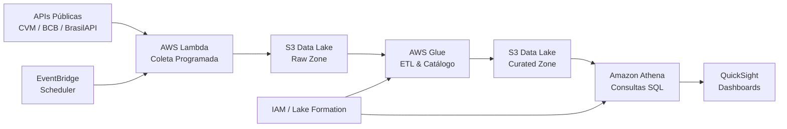

# 📊 Análise de Portfólio de Fundos de Investimento — Stack AWS

> **Projeto de portfólio para vaga Analista de Portfólio de Analytics Júnior (PcD) — Itaú Unibanco**

[](https://www.python.org/)
[](https://jupyter.org/)
[](https://plotly.com/)
[](LICENSE)

---

## 🎯 Objetivo

Demonstrar competências em **coleta, limpeza, análise e visualização de dados financeiros públicos** utilizando Python 100% local, com uma seção dedicada à **arquitetura conceitual AWS** (S3, Glue, Athena, QuickSight, Lambda) — stack utilizada pelo Itaú para modernização de dados.

O projeto simula o pipeline completo de um analista de portfólio:
1. Ingestão de dados públicos (CVM, BrasilAPI, BCB)
2. ETL e feature engineering
3. Análise exploratória com métricas de negócio
4. Visualizações interativas com benchmark CDI
5. Roadmap de escalabilidade para cloud AWS

---

## 📁 Estrutura do Projeto

```
portfolio-analytics-fundos/
├── notebook.ipynb          # Notebook Jupyter completo (8 seções)
├── requirements.txt         # Dependências Python (versões estáveis)
├── README.md               # Este arquivo
└── linkedin_post.md        # Rascunho de postagem LinkedIn
```

---

## 🚀 Como Rodar (100% Local)

```bash
# 1. Clone o repositório
git clone https://github.com/RodrigoPresida/portfolio-analytics-fundos.git
cd portfolio-analytics-fundos

# 2. Crie um ambiente virtual
python -m venv venv
source venv/bin/activate      # Linux/Mac
venv\Scripts\activate         # Windows

# 3. Instale as dependências
pip install -r requirements.txt

# 4. Execute o notebook
jupyter notebook notebook.ipynb
```

> ⚠️ A primeira execução requer internet para coleta dos dados. Execuções subsequentes funcionam offline.

---

## 🛠️ Stack Local

| Tecnologia | Propósito |
|------------|-----------|
| Python 3.10+ | Linguagem base |
| pandas, numpy | Manipulação e análise de dados |
| requests | Coleta de APIs públicas |
| plotly, matplotlib, seaborn | Visualização interativa e estática |
| Jupyter Notebook | Ambiente de execução e documentação |

---

## ☁️ Arquitetura AWS Conceitual

Se este projeto fosse escalado na infraestrutura do Itaú:



### Justificativa Técnica

| Serviço | Por quê | Custo mensal estimado |
|---------|--------|----------------------|
| **S3** | Armazenamento durável e barato, particionado por data/fonte. Versionamento para governança. | ~R$ 5/mês (10 GB) |
| **Lambda** | Serverless, escala a zero. Ideal para jobs de coleta diários (< 15 min). | ~R$ 0 (free tier) |
| **Glue** | Catálogo de dados + ETL Spark. Integração nativa com Athena. | ~R$ 30/mês (2 DPU) |
| **Athena** | SQL direto no S3, sem servidor. Ideal para analistas de negócio. | ~R$ 10/mês (consultas) |
| **QuickSight** | Dashboards interativos com controle de acesso por perfil (IAM). | ~R$ 80/mês (autor) |
| **EventBridge** | Orquestração serverless de jobs (cron). | ~R$ 0 (free tier) |

---

## ♿ Acessibilidade

Este projeto adota práticas alinhadas à vaga afirmativa PcD:

- ✅ **Alto contraste**: Visualizações com paletas acessíveis (viridis, cividis)
- ✅ **Alt-text em gráficos**: Descrições textuais em todas as visualizações
- ✅ **Navegação por teclado**: Notebook com células navegáveis via `Shift+Enter` / `Esc`
- ✅ **Documentação em Markdown**: Leitura compatível com leitores de tela
- ✅ **Tamanho de fonte**: Configurado para 14pt mínimo em visualizações

---

## 📈 Conexão com a Vaga

| Requisito da Vaga | Demonstrado no Projeto |
|-------------------|------------------------|
| Modernização AWS | Seção 7 — arquitetura S3/Glue/Athena/QuickSight completa |
| Democratização de dados | Dados públicos + visualizações interativas acessíveis |
| Automação e escala | Funções modulares, pipeline reprodutível, desenho serverless |
| Análise quantitativa | EDA, métricas de retorno, benchmark CDI, visualização de risco |

---

## 📄 Licença

MIT — veja [LICENSE](LICENSE).

---

*Desenvolvido por Rodrigo Cruz dos Santos — candidato à vaga Analista de Portfólio de Analytics Júnior (PcD) no Itaú Unibanco.*
