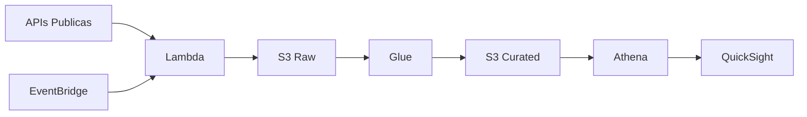

# Analise de Fundos de Investimento — Python + AWS

Estudo sobre o mercado brasileiro de fundos de investimento usando dados publicos e Python. O notebook vai da coleta ate a visualizacao, passando por limpeza, analise exploratoria e uma discussao sobre como esse pipeline escalaria pra cloud.

Nao tem API key, nao tem conta em cloud, nao tem segredo. Roda local, offline depois do primeiro fetch.

---

## Resultados reais (execucao com dados CVM + BCB)

A ultima execucao contra os dados reais da CVM (maio/2026) revelou coisas que dado sintetico nenhum mostraria:

- **46.810 fundos no cadastro da CVM. Apenas 22 ativos.**
  Os outros 46.568 (99.5%) estao cancelados. O CSV bruto e 99.5% ruido — a primeira tarefa do analista e filtrar.

- **FGTS concentra 83.8% do patrimonio liquido.**
  O FI-FGTS, gerido pela Caixa, detem R$ 11.67 bilhoes. Isso deixa o HHI em 7.061 — mercado altamente concentrado. O segundo colocado (FII Macam Shopping) tem R$ 470 milhoes.

- **FII domina em quantidade (7 dos 22 ativos).**
  Mas o top 5 por PL e dominado por um unico fundo de um unico gestor. Quantidade != relevancia.

- **CDI medio: 1.06% ao mes (ultimos 20 registros BCB).**
  O benchmark que todo fundo tenta bater.

---

## O que tem no notebook

1. **Coleta de dados** — CVM, BCB e BrasilAPI. Se a API cair, tem fallback sintetico.
2. **Limpeza e feature engineering** — normalizacao, tipagem, faixas de patrimonio, idade do fundo, metricas de eficiencia
3. **Analise exploratoria** — distribuicao por classe, concentracao (HHI), correlacoes, top gestores
4. **Visualizacoes interativas** — Plotly com tema escuro e paletas compativeis com daltonismo
5. **Resultados reais** — secao com a execucao contra dados atuais da CVM e BCB
6. **Escalando pra cloud** — arquitetura AWS conceitual (S3, Glue, Athena, QuickSight, Lambda) com justificativa de custo
7. **Notas de acessibilidade** — praticas de alto contraste, alt-text e navegacao por teclado

---

## Como rodar

```bash
git clone https://github.com/RodrigoPresida/portfolio-analytics-fundos.git
cd portfolio-analytics-fundos

python -m venv venv
source venv/bin/activate      # Linux/Mac
venv\Scripts\activate         # Windows

pip install -r requirements.txt
jupyter notebook notebook.ipynb
```

A primeira execucao baixa os dados das APIs publicas. Depois disso funciona offline (cache local de 6h).

---

## Stack

| Biblioteca | Uso |
|------------|-----|
| pandas, numpy | manipulacao e analise |
| requests | coleta das APIs |
| plotly | visualizacao interativa |
| matplotlib, seaborn | heatmap e graficos estaticos |

---

## Arquitetura cloud (conceitual)

Como o pipeline evolui quando o volume de dados cresce e a automacao passa a ser necessaria:



| Servico | Por que | Custo estimado/mes |
|---------|--------|-------------------|
| S3 | Storage barato, versionado, particionado | ~R$ 5 (10 GB) |
| Lambda | Serverless, escala a zero, zero fixo | ~R$ 0 (free tier) |
| Glue | Catalogo + ETL Spark, nativo com Athena | ~R$ 30 (2 DPU) |
| Athena | SQL direto no S3, sem servidor | ~R$ 10 |
| QuickSight | Dashboard com controle de acesso (IAM) | ~R$ 80 (autor) |
| EventBridge | Cron serverless pros jobs diarios | ~R$ 0 |

---

## Acessibilidade

Todas as visualizacoes usam paletas de alto contraste (viridis, cividis). Cada grafico tem descricao textual. O notebook segue hierarquia de headings pra navegacao via leitor de tela. Fonte minima de 14pt.

Nao e checklist — e como o projeto foi pensado desde o inicio.

---

## Licenca

MIT

---

*Rodrigo Cruz dos Santos*
